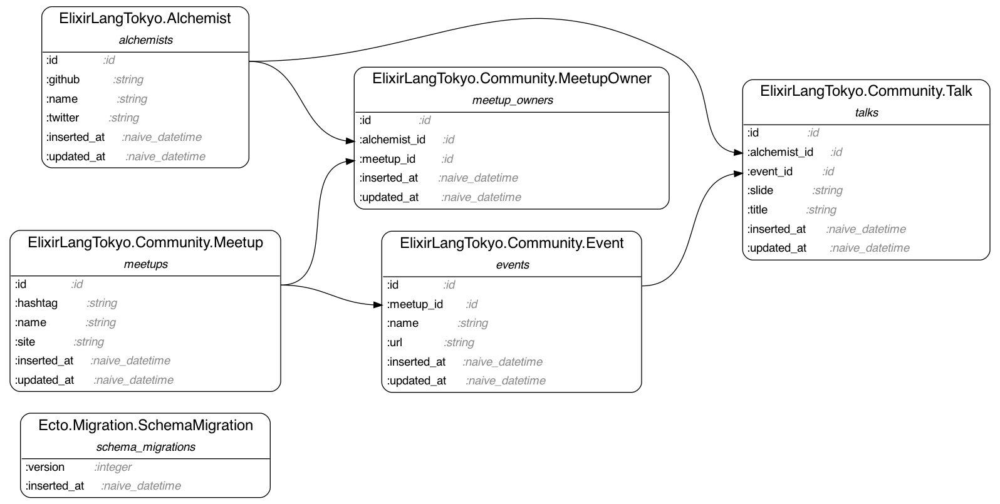

# elixir-lang.tokyo

## CI Status

| branch  | CircleCI                                                                                                                                                  |
|:--------|:----------------------------------------------------------------------------------------------------------------------------------------------------------|
| master  | [](https://circleci.com/gh/ohr486/elixir-lang.tokyo/tree/master)   |
| develop | [](https://circleci.com/gh/ohr486/elixir-lang.tokyo/tree/develop) |

## How to setup local env

```bash
$ git clone git@github.com:ohr486/elixir-lang.tokyo.git
$ cd elixir-lang.tokyo/app
$ docker-compose build
$ docker-compose run app mix setup
$ docker-compose run app mix ecto.migrate
$ docker-compose up -d
```

## ERD

```bash
$ cd app
$ docker-compose run app mix erd
$ ./open_erd.sh
```




## TODO: How to setup AWS Resources

```bash
$ cd aws
$ terraform init
$ terraform plan
```

## TODO: Reference Implementation List

- App
  - Database
    - RDB
      - [ ] PostgreSQL
      - [x] MySQL
      - [ ] CloudSpanner
    - CloudDB
      - [ ] DynamoDB
    - KVS
      - [ ] Redis
      - [ ] Memcached
    - MultiDB
      - TODO
  - Auth
    - Oauth
      - [ ] Google
      - [ ] Twitter
      - [ ] Facebook
      - [ ] GitHub
    - LDAP
      - [ ] ex\_ldap
    - Web3
      - [ ] MM
  - API
    - REST
      - [ ] PhoenixController
    - WebSocket
      - [ ] PhoenixChannel
    - GraphQL
      - TODO
    - gRPC
      - TODO
  - PubSub
    - TODO
  - View
    - TODO
  - Configuration
    - [ ] dotenv
  - Task Queue
    - [ ] exq
  - CLI
    - TODO
  - Admin
    - [ ] ex\_admin
  - Mail
    - TODO
  - Monitoring
    - Logging
      - TODO
    - APM
      - [ ] NewRelic
      - [ ] DataDog
      - [ ] AppSignal
      - [ ] ScountApp
      - [ ] Splunk
    - Error
      - [ ] Sentry
      - [ ] Honeybadger

- Local Development Environment
  - Docker
    - [x] Dockerfile
    - [x] docker-compose
  - DeBug
    - TODO
  - Test
    - Lint
      - [x] credo
      - [ ] dogma
    - Static Analysis
      - [ ] dialyxir
    - TDD
      - TODO
    - BDD
      - TODO
  - Document
    - Swagger
      - [ ] phoenix\_swagger
    - API Spec
      - [ ] Postman
    - ERD
      - [x] ecto\_erd
  - IDE/Editor
    - [ ] VisualStudioCode
    - [ ] JetBrain
    - [ ] vim
    - [ ] emacs

- DevOps
  - CI
    - [ ] Github Action
    - [x] CircleCI
    - [ ] TravisCI
  - Notification
    - [ ] slack
    - [ ] discord
    - [ ] chatwork
  - Bot
    - TODO

- Load Test
  - TODO

- Security Test
  - TODO

- Infrastructure
  - Cloud
    - AWS
      - Domain
        - [ ] Route53
      - Network
        - [ ] VPN
      - LoadBalancer
        - [ ] ALB
      - Compute
        - [ ] EC2
        - [ ] ECS
        - [ ] EKS
      - Database
        - [ ] Aurora
        - [ ] ElastiCache
      - CDN
        - [ ] S3
        - [ ] CloudFront
      - CI/CD
        - [ ] CodePipeline
        - [ ] CodeBuild
        - [ ] CodeDeploy
      - Firewall
        - [ ] WAF
      - Security
        - TODO
    - GCP
      - TODO
    - Azure
      - TODO
  - PaaS
    - [ ] Heroku
    - [ ] Gigalixir
    - [ ] Fly.io

